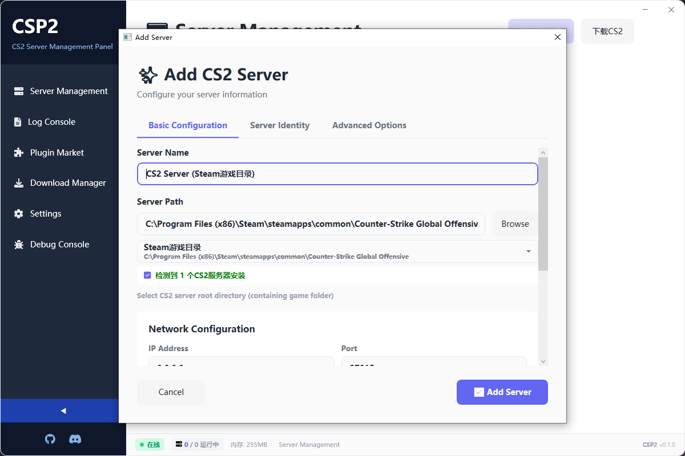

# CSP2 - Counter-Strike 2 Server Panel(开发中 需要帮助👋)

> 🎮 开源的CS2服务器管理面板，让服务器管理变得简单高效

[](https://opensource.org/licenses/MIT)
[](https://dotnet.microsoft.com/)
[](https://www.microsoft.com/windows)

[English](README.md) | **简体中文**

---

##  简介

CSP2 是一款面向 CS2 服务器管理员的开源桌面管理工具，灵感来源于 Minecraft 的 PCL2 启动器。它提供了直观的图形界面，让服务器管理、插件安装、日志查看等操作变得简单快捷。

###  核心特性

-  **一键启动**: 快速启动和管理 CS2 专用服务器
-  **实时监控**: 实时查看服务器日志和状态
-  **插件管理**: 浏览、安装、更新插件，支持多种框架
-  **多服务器**: 同时管理多个服务器实例
- ⚙️ **简洁配置**: 直接输入启动参数，最大化灵活性
-  **可扩展**: 基于 Provider 机制，社区可贡献新功能
-  **现代UI**: 简洁美观的用户界面

###  适用人群

- CS2 社区服务器管理员
- 服务器运营者
- 插件开发者
- 想快速搭建 CS2 服务器的玩家

---

##  预览

> 项目仍在开发中




---

## 🚀 快速开始

### 系统要求

- **操作系统**: Windows 10/11 (64位)
- **.NET Runtime**: .NET 8.0 或更高版本
- **磁盘空间**: 至少 100MB
- **内存**: 建议 4GB 以上

### 安装步骤

#### 方式一：下载预编译版本（推荐）

1. 前往 [Releases](https://github.com/yichen11818/csp2/releases) 页面(仍在开发)
2. 下载最新版本的 `CSP2-vX.X.X-Windows.zip`
3. 解压到任意目录
4. 运行 `CSP2.Desktop.exe`

#### 方式二：从源码编译


**手动编译**：

```bash
# 1. 克隆仓库
git clone https://github.com/yichen11818/csp2.git
cd csp2

# 2. 还原依赖
dotnet restore

# 3. 编译项目
dotnet build --configuration Release

# 4. 运行
cd src/CSP2.Desktop/bin/Release/net8.0-windows
./CSP2.Desktop.exe
```


---

##  使用指南

### 基本流程

1. **添加服务器**
   - 选择已有的 CS2 安装路径
   - 或通过 SteamCMD 下载专用服务器（开发中）

2. **安装插件框架**
   - 一键安装 Metamod
   - 一键安装 CounterStrikeSharp

3. **浏览插件市场**
   - 搜索并安装所需插件
   - 管理已安装的插件

4. **启动服务器**
   - 配置服务器参数
   - 启动并实时查看日志

---

## 🔌 支持的插件框架

| 框架 | 状态 | 说明 |
|------|------|------|
| Metamod:Source | ✅ 开发中 | CS2 插件加载器基础 |
| CounterStrikeSharp | ✅ 开发中 | C# 插件开发框架 |
| Swiftly | 🚧 计划中 | 新兴插件框架 |


*社区可以通过实现 `IFrameworkProvider` 接口来添加新框架支持*


## 🤝 参与贡献

我们欢迎所有形式的贡献！无论是报告 Bug、提出功能建议、改进文档，还是提交代码。

### 贡献方式

1. **报告 Bug**: 在 [Issues](https://github.com/yichen11818/csp2/issues) 中提交
2. **功能建议**: 在 [Discussions](https://github.com/yichen11818/csp2/discussions) 中讨论
3. **提交代码**: Fork 项目，创建 Pull Request
4. **翻译**: 帮助翻译界面到其他语言


### 开发者指南

查看以下文档开始参与开发：

- [技术设计文档](docs/01-技术设计文档.md)
- [项目结构说明](docs/02-项目结构说明.md)
- [开发路线图](docs/03-开发路线图.md)

#### 🔥 热重载开发模式（Hot Reload）

为了提高开发效率，项目已配置热重载功能：

**方式一：使用批处理脚本（推荐）**
```bash
# 双击运行或在命令行执行
hot-reload.bat
```

**方式二：使用 dotnet watch**
```bash
cd src/CSP2.Desktop
dotnet watch run
```

**方式三：Visual Studio 2022**
- 直接按 F5 调试运行
- 修改 XAML 文件时会自动刷新 UI
- 修改 C# 代码时点击"热重载"按钮或等待自动重编译

**热重载支持：**
- ✅ XAML 文件修改（即时生效，无需重启）
- ✅ C# 代码修改（大部分情况下支持）
- ✅ 样式和资源文件修改
- ❌ 新增文件需要重新编译
- ❌ 修改构造函数签名需要重启


---

##  项目结构

```
csp2/
├── src/
│   ├── CSP2.Core/              # 核心库（接口和服务）
│   ├── CSP2.Providers/         # 官方 Provider 实现
│   └── CSP2.Desktop/           # WPF 桌面应用
├── plugin-repository/          # 插件市场仓库（Git 子模块）
│   ├── plugins/                # 插件元数据文件
│   ├── manifest.json           # 自动生成的插件清单
│   └── schemas/                # JSON Schema 定义
├── tests/                      # 单元测试
├── docs/                       # 文档
├── data/                       # 运行时数据（服务器、设置）
├── providers/                  # 第三方 Provider
├── .github/                    # GitHub 配置
└── README.md
```

---

##  技术栈

- **前端**: WPF (.NET 8.0)
- **架构**: MVVM (CommunityToolkit.Mvvm)
- **依赖注入**: Microsoft.Extensions.DependencyInjection
- **日志**: Serilog
- **HTTP**: HttpClient + Polly
- **JSON**: System.Text.Json

未来计划迁移到 **Avalonia UI** 以实现跨平台支持。

---

##  常见问题

### Q: 支持哪些操作系统？
A: 当前版本仅支持 Windows。Linux 支持将在 v2.0 版本中提供。


### Q: 插件数据从哪里来？
A: 从我们维护的 [插件仓库](https://github.com/yichen11818/csp2-plugin-repository)，该仓库作为 Git 子模块包含在项目中。仓库会自动跟踪和索引 GitHub 上的 CS2 插件。

---

## 📧 联系方式

- **Issues**: [GitHub Issues](https://github.com/yichen11818/csp2/issues)
- **Discussions**: [GitHub Discussions](https://github.com/yichen11818/csp2/discussions)

---

## ⭐ Star History

如果这个项目对您有帮助，请给我们一个 Star ⭐！

[](https://star-history.com/#yichen11818/csp2&Date)

---

<p align="center">
  Made with ❤️ by CSP2 Community
</p>

